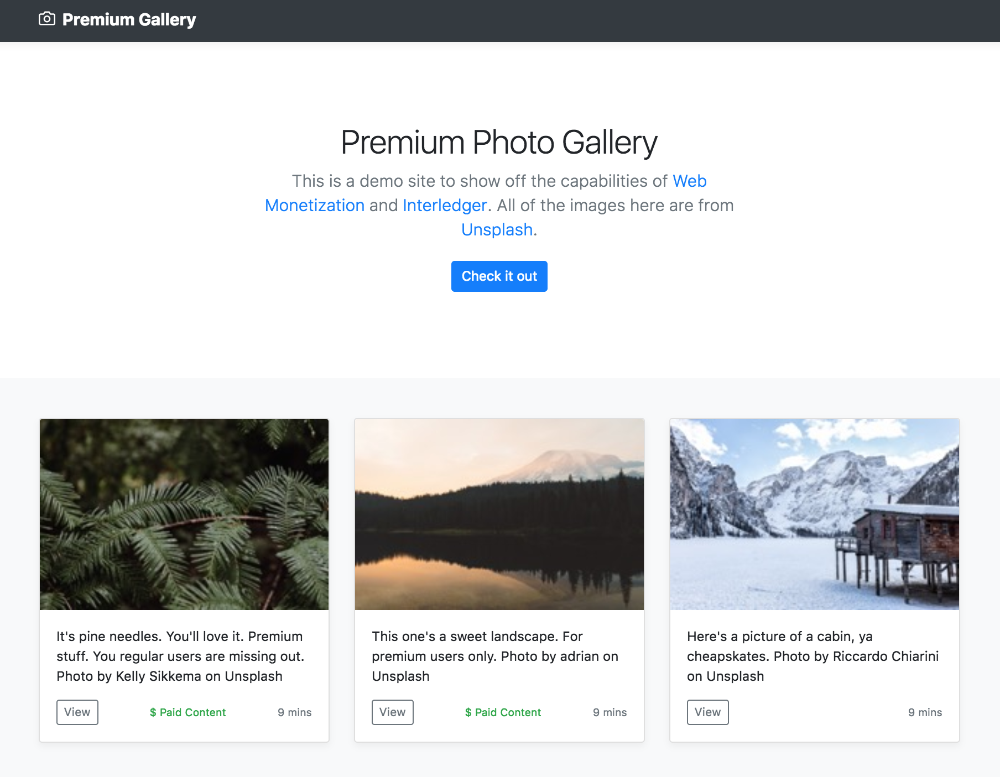

# Web Monetization Gallery
> A gallery of photos that are paywalled with Web Monetization

- [Overview](#overview)
- [How to Run](#how-to-run)
  - [Prerequisites](#prerequisites)
  - [Install and Run](#install-and-run)



## Overview

Example use of [Koa Web Monetization](https://github.com/sharafian/koa-web-monetization)

## How to Run

### Prerequisites

- You should be running [Moneyd](https://github.com/interledgerjs/moneyd-xrp)
  for Interledger payments. [Local
  mode](https://github.com/interledgerjs/moneyd-xrp#local-test-network) will work
  fine.

- Build and install the [Minute](https://github.com/sharafian/minute)
  extension. This adds Web Monetization support to your browser.

### Install and Run

```sh
git clone https://github.com/sharafian/web-monetization-gallery.git
cd web-monetization-gallery
npm install
DEBUG=koa* node index.js
```
